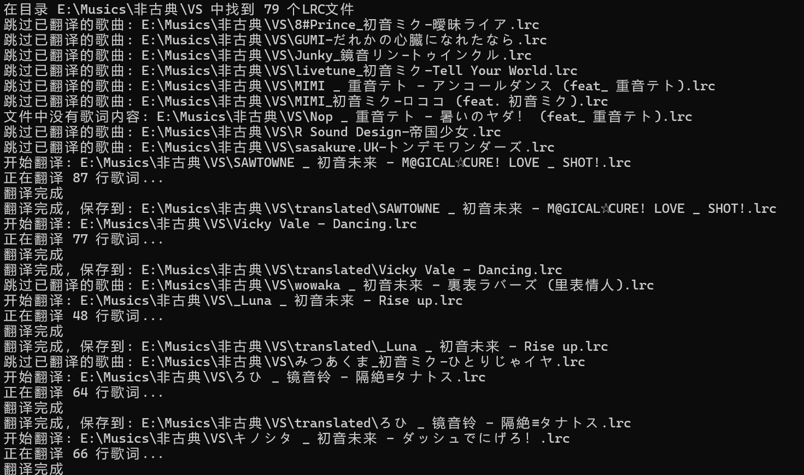
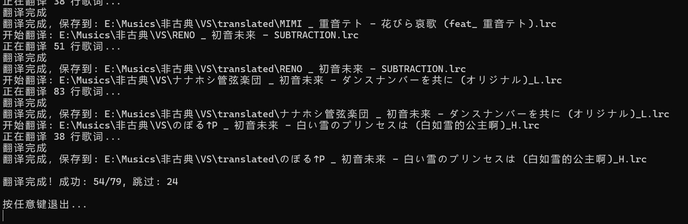

# LrcTranslator

LRC歌词翻译工具，支持使用多种AI翻译服务自动翻译歌词文件。只需配置对应AI平台的 api-key 即可。





## 功能特性

- 支持多种AI翻译服务：OpenAI、ChatGPT、DeepSeek
- 自动检测LRC文件编码（支持UTF-8、GBK、Big5等多种编码）
- 支持单个LRC文件或整个目录批量翻译
- 保留原歌词时间轴，生成双语歌词
- 可将已翻译文件恢复为原文

## 安装依赖

```bash
pip install -r requirements.txt
```

## 配置说明

1. 复制 `.env.example` 文件为 `.env`：

```bash
cp .env.example .env
```

2. 编辑 `.env` 文件，配置您的AI翻译API密钥：

```env
# OpenAI API配置
OPENAI_API_KEY=your_openai_api_key_here
OPENAI_API_BASE=https://api.openai.com/v1

# ChatGPT API配置（使用第三方中转）
CHATGPT_API_KEY=your_chatgpt_api_key_here
CHATGPT_API_BASE=https://api.chatgpt.com/v1

# DeepSeek API配置
DEEPSEEK_API_KEY=your_deepseek_api_key_here
DEEPSEEK_API_BASE=https://api.deepseek.com/v1
DEEPSEEK_MODEL=deepseek-chat

# 默认翻译服务
DEFAULT_TRANSLATOR=openai

# 目标语言（默认中文）
TARGET_LANGUAGE=zh
```

## 使用方法

### 命令行参数

```bash
python main.py <lrc文件或目录路径> [翻译器类型]
```

### 翻译器类型

| 类型 | 说明 |
|------|------|
| `openai` | 使用OpenAI API（默认） |
| `chatgpt` | 使用ChatGPT API |
| `deepseek` | 使用DeepSeek API |

### 使用示例

```bash
# 翻译单个LRC文件（使用默认OpenAI）
python main.py ./song.lrc

# 翻译整个目录（使用DeepSeek）
python main.py ./lyrics deepseek

# 使用ChatGPT翻译
python main.py ./song.lrc chatgpt
```

翻译后的文件会保存在原文件所在目录的 `translated/` 目录下，文件名保持不变。

## 检测已翻译文件

程序会自动检测已翻译的文件，并询问用户是否恢复原文，恢复的原文文件会保存到原文件所在目录的 `original/` 目录下。